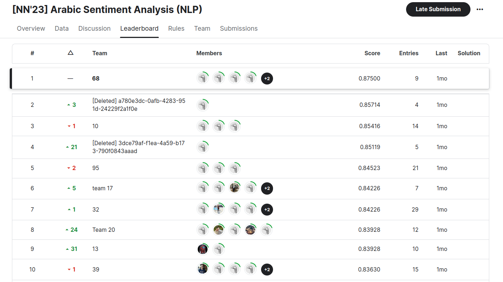

# Arabic Sentiment Analysis

> LLMs know everything, but don't understand anything.
>
> \- Omar Yasser

This project focuses on the sentiment analysis of company reviews in various dialects of Arabic. 

## Preprocessing

1. **Data Cleansing**: Removal of nulls and duplicates to ensure a clean dataset.
2. **Text Normalization**: Stripping away punctuation, digits, and special characters to focus on the linguistic essence.
3. **Diacritic Handling**: Removing diacritics and normalizing Arabic characters to address the variability in text input.
4. **Language Homogenization**: Translating the few non-Arabic words into Arabic to maintain linguistic consistency.
5. **Emoji Mapping**: Emojis, often conveying strong sentiments, were mapped to their textual meanings.

## Models

Four models were implemented:

1. [**Finetuned AraBERT**](arabert_finetuning.ipynb): Leveraging the power of AraBERT, finetuned to our specific dataset.
2. [**Transformer from Scratch**](transformer.ipynb): Building a Transformer model from the ground up, to better understand its architecture.
3. [**LSTM**](lstm.ipynb)
4. [**Bidirectional LSTM**](bidirectional_lstm.ipynb): LSTM, but it captures both forward and backward directions.

## Results

Our team **won** in a Kaggle university-wide Arabic Sentiment Analysis competition (out of more than 100 teams). 
Our model achieved an impressive **87.5% accuracy**, outperforming the second-best team by a significant margin of **2%**.

 ## Team Members

- [@Omar-Yasser](https://github.com/Omar-Yasser)  
- [@mh084449](https://github.com/mh084449) 
- [@Silverhorse7](https://github.com/Silverhorse7)  
- [@SalmaAlassal](https://github.com/SalmaAlassal)  
- [@tenafrangelos](https://github.com/tenafrangelos) 
- [@SalmaMahdyy](https://github.com/SalmaMahdyy)
